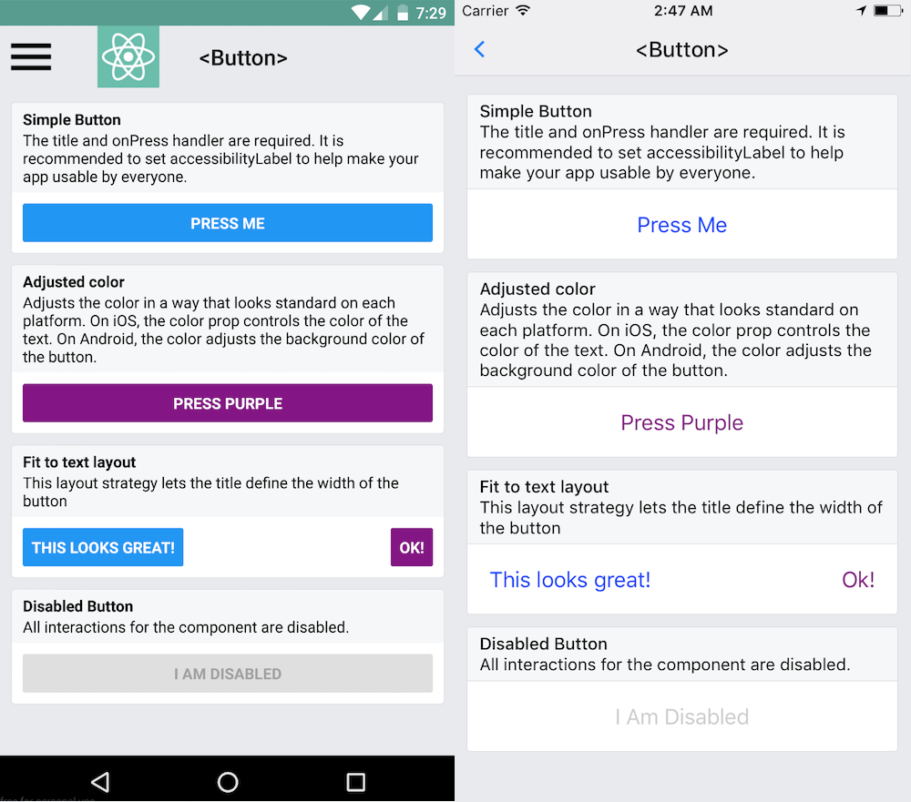

A basic button component that should render nicely on any platform. Supports a minimal level of customization.



If this button doesn't look right for your app, you can build your own button using TouchableOpacity or TouchableNativeFeedback. For inspiration, 推荐观看视频教程[如何制作一个按钮](http://v.youku.com/v_show/id_XMTQ5OTE3MjkzNg==.html?f=26822355&from=y1.7-1.3)。 Or, take a look at the wide variety of button components built by the community.


Example usage:

```js
<Button
  onPress={onPressLearnMore}
  title="Learn More"
  color="#841584"
  accessibilityLabel="Learn more about this purple button"
/>
```

### 属性
<div class="props">
    <div class="prop"><h4 class="propTitle"><a class="anchor" name="accessibilitylabel"></a>accessibilityLabel <span
            class="propType">string</span> <a class="hash-link" href="#accessibilitylabel">#</a></h4>
        <div><p>Text to display for blindness accessibility features</p></div>
    </div>
    <div class="prop"><h4 class="propTitle"><a class="anchor" name="color"></a>color <span class="propType"><a
            href="docs/colors.html">color</a></span> <a class="hash-link" href="#color">#</a></h4>
        <div><p>Color of the text (iOS), or background color of the button (Android)</p></div>
    </div>
    <div class="prop"><h4 class="propTitle"><a class="anchor" name="disabled"></a>disabled <span
            class="propType">bool</span> <a class="hash-link" href="#disabled">#</a></h4>
        <div><p>If true, disable all interactions for this component.</p></div>
    </div>
    <div class="prop"><h4 class="propTitle"><a class="anchor" name="onpress"></a>onPress <span
            class="propType">function</span> <a class="hash-link" href="#onpress">#</a></h4>
        <div><p>Handler to be called when the user taps the button</p></div>
    </div>
    <div class="prop"><h4 class="propTitle"><a class="anchor" name="title"></a>title <span
            class="propType">string</span> <a class="hash-link" href="#title">#</a></h4>
        <div><p>Text to display inside the button</p></div>
    </div>
</div>


### 方法

<div class="props">
    <div class="prop">
        <h4 class="methodTitle">
            <a class="anchor" name="getadvertisingid"></a>
            <span class="methodType">static </span>getAdvertisingId<span class="methodType">(onSuccess, onFailure)</span> 
            <a class="hash-link" href="#getadvertisingid">#</a>
        </h4>
    </div>
    <div class="prop">
        <h4 class="methodTitle">
            <a class="anchor" name="getadvertisingtrackingenabled"></a>
            <span class="methodType">static </span>getAdvertisingTrackingEnabled<span class="methodType">(onSuccess, onFailure)</span> 
            <a class="hash-link" href="#getadvertisingtrackingenabled">#</a>
        </h4>
    </div>
</div>

### 例子

```javascript
use strict';

const React = require('react');
const ReactNative = require('react-native');
const {
  Alert,
  Button,
  View,
} = ReactNative;

const onButtonPress = () => {
  Alert.alert('Button has been pressed!');
};

exports.displayName = 'ButtonExample';
exports.framework = 'React';
exports.title = '<Button>';
exports.description = 'Simple React Native button component.';

exports.examples = [
  {
    title: 'Simple Button',
    description: 'The title and onPress handler are required. It is ' +
      'recommended to set accessibilityLabel to help make your app usable by ' +
      'everyone.',
    render: function() {
      return (
        <Button
          onPress={onButtonPress}
          title="Press Me"
          accessibilityLabel="See an informative alert"
        />
      );
    },
  },
  {
    title: 'Adjusted color',
    description: 'Adjusts the color in a way that looks standard on each ' +
      'platform. On iOS, the color prop controls the color of the text. On ' +
      'Android, the color adjusts the background color of the button.',
    render: function() {
      return (
        <Button
          onPress={onButtonPress}
          title="Press Purple"
          color="#841584"
          accessibilityLabel="Learn more about purple"
        />
      );
    },
  },
  {
    title: 'Fit to text layout',
    description: 'This layout strategy lets the title define the width of ' +
      'the button',
    render: function() {
      return (
        <View style={{flexDirection: 'row', justifyContent: 'space-between'}}>
          <Button
            onPress={onButtonPress}
            title="This looks great!"
            accessibilityLabel="This sounds great!"
          />
          <Button
            onPress={onButtonPress}
            title="Ok!"
            color="#841584"
            accessibilityLabel="Ok, Great!"
          />
        </View>
      );
    },
  },
  {
    title: 'Disabled Button',
    description: 'All interactions for the component are disabled.',
    render: function() {
      return (
        <Button
          disabled
          onPress={onButtonPress}
          title="I Am Disabled"
          accessibilityLabel="See an informative alert"
        />
      );
    },
  },
];
```
