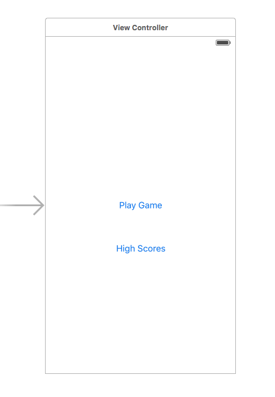
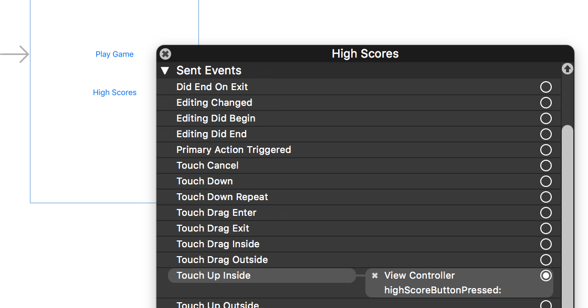

<div class="integration-toggler">
<style>
.integration-toggler {
  margin-bottom: 10px;
}
.integration-toggler a {
  display: inline-block;
  padding: 10px 5px;
  margin: 2px;
  border: 1px solid #05A5D1;
  border-radius: 3px;
  text-decoration: none !important;
}
.display-platform-objc .integration-toggler .button-objc,
.display-platform-swift .integration-toggler .button-swift,
.display-platform-android .integration-toggler .button-android {
  background-color: #05A5D1;
  color: white;
}
.md-block { display: none; }
.md-block img { max-width:650px; }
.display-platform-objc .objc,
.display-platform-swift .swift,
.display-platform-android .android {
  display: block;
}
</style>
<span>平台:</span>
<a class="button-objc" onclick="display('platform', 'objc')">Objective-C</a>
<a class="button-swift" onclick="display('platform', 'swift')">Swift</a>
<a class="button-android" onclick="display('platform', 'android')">Android</a>
</div>
<div markdown class="md-block objc swift android">

## 核心概念

如果你正准备从头开始制作一个新的应用，那么React Native会是个非常好的选择。但如果你只想给现有的原生应用中添加一两个视图或是业务流程，React Native也同样不在话下。只需简单几步，你就可以给原有应用加上新的基于React Native的特性、画面和视图等。

</div>
<div markdown class="md-block objc swift">

把React Native组件植入到iOS应用中有如下几个主要步骤：

1. 首先当然要了解你要植入的React Native组件。
2. 创建一个`Podfile`，在其中以`subspec`的形式填写所有你要植入的React Native的组件。
3. 创建js文件，编写React Native组件的js代码。
4. 添加一个事件处理函数，用于创建一个`RCTRootView`。这个`RCTRootView`正是用来承载你的React Native组件的，而且它必须对应你在`index.ios.js`中使用`AppRegistry`注册的模块名字。
5. 启动React Native的Packager服务，运行应用。
6. 根据需要添加更多React Native的组件。
7. [调试](debugging.html)。
8. 准备[部署发布](running-on-device-ios.html) （比如可以利用`react-native-xcode.sh`脚本）。
9. 发布应用，升职加薪，走向人生巅峰！😘

</div>
<div markdown class="md-block android">

把React Native组件植入到Android应用中有如下几个主要步骤：

1. 首先当然要了解你要植入的React Native组件。
2. 在Android项目根目录中使用npm来安装`react-native` ，这样同时会创建一个`node_modules/`的目录。
3. 创建js文件，编写React Native组件的js代码。
4. 在`build.gradle`文件中添加`com.facebook.react:react-native:+`，以及一个指向`node_nodules/`目录中的`react-native`预编译库的`maven`路径。
5. 创建一个React Native专属的`Activity`，在其中再创建`ReactRootView`。
6. 启动React Native的Packager服务，运行应用。
7. 根据需要添加更多React Native的组件。
8. 在真机上[运行](running-on-device-android.html)、[调试](debugging.html)。
9. [打包](signed-apk-android.html)。
10. 发布应用，升职加薪，走向人生巅峰！😘

</div>
<div markdown class="md-block objc swift android">

## 开发环境准备  

</div>
<div markdown class="md-block android">

首先按照[开发环境搭建教程](getting-started.html)来安装React Native在安卓平台上所需的一切依赖软件（比如`npm`）。

</div>
<div markdown class="md-block objc swift">

### 基础环境

首先按照[开发环境搭建教程](getting-started.html)来安装React Native在iOS平台上所需的一切依赖软件（比如`npm`）。

### CocoaPods

[CocoaPods](http://cocoapods.org)是针对iOS和Mac开发的包管理工具。我们用它来把React Native框架的代码下载下来并添加到你当前的项目中。

```bash
$ sudo gem install cocoapods
```

> 从技术上来讲，我们完全可以跳过CocoaPods，但是这样一来我们就需要手工来完成很多配置项。CocoaPods可以帮我们完成这些繁琐的工作。


## 示例App

</div>
<div markdown class="md-block objc">

在本教程中我们用于[示范的app](https://github.com/JoelMarcey/iOS-2048)是一个[2048](https://en.wikipedia.org/wiki/2048_(video_game)类型的游戏。 下面是这个游戏还没有植入React Native时的主界面：

</div>
<div markdown class="md-block swift">

在本教程中我们用于[示范的app](https://github.com/JoelMarcey/swift-2048)是一个[2048](https://en.wikipedia.org/wiki/2048_(video_game)类型的游戏。下面是这个游戏还没有植入React Native时的主界面： 

</div>
<div markdown class="md-block objc swift">


## 依赖包

React Native的植入过程同时需要React和React Native两个node依赖包。

### `package.json`

我们把具体的依赖包记录在`package.json`文件中。如果项目根目录中没有这个文件，那就自己创建一个。

> 对于一个典型的React Native项目来说，一般`package.json`和`index.ios.js`等文件会放在项目的根目录下。而iOS相关的原生代码会放在一个名为`ios/`的子目录中,这里也同时放着你的Xcode项目文件（`.xcodeproj`）。

下面是一个最简单的`package.json`的内容示例。

> 示例中的`version`字段没有太大意义（除非你要把你的项目发布到npm仓库）。`scripts`中是用于启动packager服务的命令。dependencies中的react和react-native的版本取决于你的具体需求。一般来说我们推荐使用最新版本。你可以使用`npm info react`和`npm info react-native`来查看当前的最新版本。另外，react-native对react的版本有严格要求，高于或低于某个范围都不可以。本文无法在这里列出所有react native和对应的react版本要求，只能提醒读者先尝试执行npm install，然后注意观察安装过程中的报错信息，例如`require react@某.某.某版本, but none was installed`，然后根据这样的提示，执行`npm i -S react@某.某.某版本`。

</div><div markdown class="md-block objc">

```bash
{
  "name": "NumberTileGame",
  "version": "0.0.1",
  "private": true,
  "scripts": {
    "start": "node node_modules/react-native/local-cli/cli.js start"
  },
  "dependencies": {
    "react": "15.4.1",
    "react-native": "0.39.2"
  }
}
```

</div><div markdown class="md-block swift">

```bash
{
  "name": "swift-2048",
  "version": "0.0.1",
  "private": true,
  "scripts": {
    "start": "node node_modules/react-native/local-cli/cli.js start"
  },
  "dependencies": {
    "react": "15.4.1",
    "react-native": "0.39.2"
  }
}
```

</div><div markdown class="md-block objc swift">

### 安装依赖包

使用npm（node包管理器，Node package manager）来安装React和React Native模块。这些模块会被安装到项目根目录下的`node_modules/`目录中。
在包含有package.json文件的目录（一般也就是项目根目录）中运行下列命令来安装：

```bash
$ npm install
```

## React Native框架

React Native框架整体是作为node模块安装到项目中的。下一步我们需要在CocoaPods的`Podfile`中指定我们所需要使用的组件。 

### Subspecs

在你开始把React Native植入到你的应用中之前，首先要决定具体整合的是React Native框架中的哪些部分。而这就是`subspec`要做的工作。在创建`Podfile`文件的时候，需要指定具体安装哪些React Native的依赖库。所指定的每一个库就称为一个`subspec`。

可用的`subspec`都列在[`node_modules/react-native/React.podspec`](https://github.com/facebook/react-native/blob/master/React.podspec)中，基本都是按其功能命名的。一般来说你首先需要添加`Core`，这一`subspec`包含了必须的`AppRegistry`、`StyleSheet`、`View`以及其他的一些React Native核心库。 If you want to add the React Native `Text` library (e.g., for `<Text>` elements), then you will need the `RCTText` `subspec`. If you want the `Image` library (e.g., for `<Image>` elements), then you will need the `RCTImage` `subspec`.

#### Podfile

After you have used Node to install the React and React Native frameworks into the `node_modules` directory, and you have decided on what React Native elements you want to integrate, you are ready to create your `Podfile` so you can install those components for use in your application.

创建`Podfile`的最简单的方式就是在iOS原生代码所在的目录中使用CocoaPods的`init`命令：

```bash
## 在iOS原生代码所在的目录中（也就是`.xcodeproj`文件所在的目录）执行：
$ pod init
```

`Podfile` will be created and saved in the *iOS* directory (e.g., `ios/`) of your current project and will contain a boilerplate setup that you will tweak for your integration purposes. In the end, `Podfile` should look something similar to this:

</div><div markdown class="md-block objc">

```
# The target name is most likely the name of your project.
target 'NumberTileGame' do

  # Your 'node_modules' directory is probably in the root of your project,
  # but if not, adjust the `:path` accordingly
  pod 'React', :path => '../node_modules/react-native', :subspecs => [
    'Core',
    'RCTText',
    'RCTNetwork',
    'RCTWebSocket', # needed for debugging
    # Add any other subspecs you want to use in your project
  ]

end
```

</div><div markdown class="md-block swift">

```
source 'https://github.com/CocoaPods/Specs.git'

# Required for Swift apps
platform :ios, '8.0'
use_frameworks!

# The target name is most likely the name of your project.
target 'swift-2048' do

  # Your 'node_modules' directory is probably in the root of your project,
  # but if not, adjust the `:path` accordingly
  pod 'React', :path => '../node_modules/react-native', :subspecs => [
    'Core',
    'RCTText',
    'RCTNetwork',
    'RCTWebSocket', # needed for debugging
    # Add any other subspecs you want to use in your project
  ]

end
```

</div><div markdown class="md-block objc swift">

#### Pod安装

创建好了`Podfile`后，就可以开始安装React Native的pod包了。

```bash
$ pod install
```

然后你应该可以看到类似下面的输出(译注：同样由于众所周知的网络原因，pod install的过程在国内非常不顺利，请自行配备稳定的翻墙工具，或是尝试一些[镜像源](https://www.baidu.com/s?ie=utf-8&f=3&rsv_bp=1&ch=2&tn=98010089_dg&wd=cocoapods%20%E9%95%9C%E5%83%8F&oq=cocoapods%E9%95%9C%E5%83%8F&rsv_pq=8fe4602600052d40&rsv_t=5d9fNEvNrqwcBS3rvMCKw0Cc%2FoW6XdW%2Bm4zks2nF3BxZ6cyWtJx1g%2F39Id6cUzeRTLM&rqlang=cn&rsv_enter=0&inputT=809&rsv_sug3=9&rsv_sug1=7&rsv_sug7=100&prefixsug=cocoapods%20%E9%95%9C%E5%83%8F&rsp=0&rsv_sug4=1010))：

```bash
Analyzing dependencies
Fetching podspec for `React` from `../node_modules/react-native`
Downloading dependencies
Installing React (0.26.0)
Generating Pods project
Integrating client project
Sending stats
Pod installation complete! There are 3 dependencies from the Podfile and 1 total pod installed.
```

</div><div markdown class="md-block swift">

> 如果你看到类似"*The `swift-2048 [Debug]` target overrides the `FRAMEWORK_SEARCH_PATHS` build setting defined in `Pods/Target Support Files/Pods-swift-2048/Pods-swift-2048.debug.xcconfig`. This can lead to problems with the CocoaPods installation*"的警告， then make sure the `Framework Search Paths` in `Build Settings` for both `Debug` and `Release` only contain `$(inherited)`.

</div><div markdown class="md-block objc swift">

## 代码集成

现在Now that we have a package foundation, we will actually modify the native application to integrate React Native into the application. For our 2048 app, we will add a "High Score" screen in React Native.

### React Native组件

The first bit of code we will write is the actual React Native code for the new "High Score" screen that will be integrated into our application.

#### 创建一个`index.ios.js`文件

首先创建一个空的`index.ios.js`文件。一般来说我们把它放置在项目根目录下。

> `index.ios.js`是React Native应用在iOS上的入口文件。而且它是不可或缺的！它可以是个很简单的文件，简单到可以只包含一行`require/import`导入语句。 is the starting point for React Native applications on iOS. And it is always required. It can be a small file that `require`s other file that are part of your React Native component or application, or it can contain all the code that is needed for it. In our case, we will just put everything in `index.ios.js`

```bash
# 在项目根目录执行以下命令创建文件：
$ touch index.ios.js
```

#### 添加你自己的React Native代码

在`index.ios.js`中添加你自己的组件。这里我们只是简单的添加一个`<Text>`组件，然后用一个带有样式的`<View>`组件把它包起来。

```js
'use strict';

import React from 'react';
import {
  AppRegistry,
  StyleSheet,
  Text,
  View
} from 'react-native';

class RNHighScores extends React.Component {
  render() {
    var contents = this.props["scores"].map(
      score => <Text key={score.name}>{score.name}:{score.value}{"\n"}</Text>
    );
    return (
      <View style={styles.container}>
        <Text style={styles.highScoresTitle}>
          2048 High Scores!
        </Text>
        <Text style={styles.scores}>
          {contents}
        </Text>
      </View>
    );
  }
}

const styles = StyleSheet.create({
  container: {
    flex: 1,
    justifyContent: 'center',
    alignItems: 'center',
    backgroundColor: '#FFFFFF',
  },
  highScoresTitle: {
    fontSize: 20,
    textAlign: 'center',
    margin: 10,
  },
  scores: {
    textAlign: 'center',
    color: '#333333',
    marginBottom: 5,
  },
});

// 整体js模块的名称
AppRegistry.registerComponent('RNHighScores', () => RNHighScores);
```

> `RNHighScores`是整体js模块（即你所有的js代码）的名称。你在iOS原生代码中添加React Native视图时会用到这个名称。

## The Magic: `RCTRootView`

Now that your React Native component is created via `index.ios.js`, you need to add that component to a new or existing `ViewController`. The easiest path to take is to optionally create an event path to your component and then add that component to an existing `ViewController`.

We will tie our React Native component with a new native view in the `ViewController` that will actually host it called `RCTRootView` .

### Create an Event Path

You can add a new link on the main game menu to go to the "High Score" React Native page.



#### 事件处理

We will now add an event handler from the menu link. A method will be added to the main `ViewController` of your application. This is where `RCTRootView` comes into play.

When you build a React Native application, you use the React Native packager to create an `index.ios.bundle` that will be served by the React Native server. Inside `index.ios.bundle` will be our `RNHighScore` module. So, we need to point our `RCTRootView` to the location of the `index.ios.bundle` resource (via `NSURL`) and tie it to the module.

We will, for debugging purposes, log that the event handler was invoked. Then, we will create a string with the location of our React Native code that exists inside the `index.ios.bundle`. Finally, we will create the main `RCTRootView`. Notice how we provide `RNHighScores` as the `moduleName` that we created [above](#the-react-native-component) when writing the code for our React Native component.

</div><div markdown class="md-block objc">

首先导入`RCTRootView`的头文件。

```
#import "RCTRootView.h"
```

> 这里的`initialProperties` are here for illustration purposes so we have some data for our high score screen. In our React Native component, we will use `this.props` to get access to that data.

```
- (IBAction)highScoreButtonPressed:(id)sender {
    NSLog(@"High Score Button Pressed");
    NSURL *jsCodeLocation = [NSURL
                             URLWithString:@"http://localhost:8081/index.ios.bundle?platform=ios"];
    RCTRootView *rootView =
      [[RCTRootView alloc] initWithBundleURL : jsCodeLocation
                           moduleName        : @"RNHighScores"
                           initialProperties :
                             @{
                               @"scores" : @[
                                 @{
                                   @"name" : @"Alex",
                                   @"value": @"42"
                                  },
                                 @{
                                   @"name" : @"Joel",
                                   @"value": @"10"
                                 }
                               ]
                             }
                           launchOptions    : nil];
    UIViewController *vc = [[UIViewController alloc] init];
    vc.view = rootView;
    [self presentViewController:vc animated:YES completion:nil];
}
```

> Note that `RCTRootView initWithURL` starts up a new JSC VM. To save resources and simplify the communication between RN views in different parts of your native app, you can have multiple views powered by React Native that are associated with a single JS runtime. To do that, instead of using `[RCTRootView alloc] initWithURL`, use [`RCTBridge initWithBundleURL`](https://github.com/facebook/react-native/blob/master/React/Base/RCTBridge.h#L93) to create a bridge and then use `RCTRootView initWithBridge`.

</div><div markdown class="md-block swift">

首先`import`导入`React`库。

```
import React
```

> The `initialProperties` are here for illustration purposes so we have some data for our high score screen. In our React Native component, we will use `this.props` to get access to that data.

```
@IBAction func highScoreButtonTapped(sender : UIButton) {
  NSLog("Hello")
  let jsCodeLocation = URL(string: "http://localhost:8081/index.ios.bundle?platform=ios")
  let mockData:NSDictionary = ["scores":
      [
          ["name":"Alex", "value":"42"],
          ["name":"Joel", "value":"10"]
      ]
  ]

  let rootView = RCTRootView(
      bundleURL: jsCodeLocation,
      moduleName: "RNHighScores",
      initialProperties: mockData as [NSObject : AnyObject],
      launchOptions: nil
  )
  let vc = UIViewController()
  vc.view = rootView
  self.present(vc, animated: true, completion: nil)
}
```

> 注意`RCTRootView bundleURL` starts up a new JSC VM. To save resources and simplify the communication between RN views in different parts of your native app, you can have multiple views powered by React Native that are associated with a single JS runtime. To do that, instead of using `RCTRootView bundleURL`, use [`RCTBridge initWithBundleURL`](https://github.com/facebook/react-native/blob/master/React/Base/RCTBridge.h#L93) to create a bridge and then use `RCTRootView initWithBridge`.

</div><div markdown class="md-block objc">

> When moving your app to production, the `NSURL` can point to a pre-bundled file on disk via something like `[[NSBundle mainBundle] URLForResource:@"main" withExtension:@"jsbundle"];`. You can use the `react-native-xcode.sh` script in `node_modules/react-native/packager/` to generate that pre-bundled file.

</div><div markdown class="md-block swift">

> When moving your app to production, the `NSURL` can point to a pre-bundled file on disk via something like `let mainBundle = NSBundle(URLForResource: "main" withExtension:"jsbundle")`. You can use the `react-native-xcode.sh` script in `node_modules/react-native/packager/` to generate that pre-bundled file.

</div><div markdown class="md-block objc swift">

#### Wire Up

Wire up the new link in the main menu to the newly added event handler method.



> One of the easier ways to do this is to open the view in the storyboard and right click on the new link. Select something such as the `Touch Up Inside` event, drag that to the storyboard and then select the created method from the list provided.

## 测试植入结果

You have now done all the basic steps to integrate React Native with your current application. Now we will start the React Native packager to build the `index.ios.bundle` packager and the server running on `localhost` to serve it.

### App Transport Security

Apple has blocked implicit cleartext HTTP resource loading. So we need to add the following our project's `Info.plist` (or equivalent) file.

```xml
<key>NSAppTransportSecurity</key>
<dict>
    <key>NSExceptionDomains</key>
    <dict>
        <key>localhost</key>
        <dict>
            <key>NSTemporaryExceptionAllowsInsecureHTTPLoads</key>
            <true/>
        </dict>
    </dict>
</dict>
```

### 运行Packager

```bash
# From the root of your project, where the `node_modules` directory is located.
$ npm start
```

### 运行应用

如果你使用的是Xcode，那么照常编译和运行应用即可。如果你没有使用Xcode（但是你仍然必须安装Xcode），则可以在命令行中使用以下命令来运行应用：

```bash
# 在项目的根目录中执行：
$ react-native run-ios
```

In our sample application, you should see the link to the "High Scores" and then when you click on that you will see the rendering of your React Native component.

Here is the *native* application home screen:


Here is the *React Native* high score screen:


> If you are getting module resolution issues when running your application please see [this GitHub issue](https://github.com/facebook/react-native/issues/4968) for information and possible resolution. [This comment](https://github.com/facebook/react-native/issues/4968#issuecomment-220941717) seemed to be the latest possible resolution.

### 看一下完整的代码变更

</div><div markdown class="md-block objc">

你可以在这个[GitHub提交记录](https://github.com/JoelMarcey/iOS-2048/commit/9ae70c7cdd53eb59f5f7c7daab382b0300ed3585)里查看一次完整的植入过程具体有哪些代码/文件变更。

</div><div markdown class="md-block swift">

你可以在这个[GitHub提交记录](https://github.com/JoelMarcey/swift-2048/commit/13272a31ee6dd46dc68b1dcf4eaf16c1a10f5229)里查看一次完整的植入过程具体有哪些代码/文件变更。

</div><div markdown class="md-block android">

## 在应用中添加JS代码

在项目的根目录中运行：

    $ npm init
    $ npm install --save react react-native
    $ curl -o .flowconfig https://raw.githubusercontent.com/facebook/react-native/master/.flowconfig

This creates a node module for your app and adds the `react-native` npm dependency. Now open the newly created `package.json` file and add this under `scripts`:

    "start": "node node_modules/react-native/local-cli/cli.js start"

首先在项目根目录中创建`index.android.js`文件，然后将下面的代码复制粘贴进来：

```js
'use strict';

import React from 'react';
import {
  AppRegistry,
  StyleSheet,
  Text,
  View
} from 'react-native';

class HelloWorld extends React.Component {
  render() {
    return (
      <View style={styles.container}>
        <Text style={styles.hello}>Hello, World</Text>
      </View>
    )
  }
}
var styles = StyleSheet.create({
  container: {
    flex: 1,
    justifyContent: 'center',
  },
  hello: {
    fontSize: 20,
    textAlign: 'center',
    margin: 10,
  },
});

AppRegistry.registerComponent('HelloWorld', () => HelloWorld);
```

## Prepare your current app

In your app's `build.gradle` file add the React Native dependency:

```
 dependencies {
     ...
     compile "com.facebook.react:react-native:+" // From node_modules.
 }
```

> If you want to ensure that you are always using a specific React Native version in your native build, replace `+` with an actual React Native version you've downloaded from `npm`.

In your project's `build.gradle` file add an entry for the local React Native maven directory:

```
allprojects {
    repositories {
        ...
        maven {
            // All of React Native (JS, Android binaries) is installed from npm
            url "$rootDir/../node_modules/react-native/android"
        }
    }
    ...
}
```

> Make sure that the path is correct! You shouldn’t run into any “Failed to resolve: com.facebook.react:react-native:0.x.x" errors after running Gradle sync in Android Studio.

Next, make sure you have the Internet permission in your `AndroidManifest.xml`:

    <uses-permission android:name="android.permission.INTERNET" />

If you need to access to the `DevSettingsActivity` add to your `AndroidManifest.xml`:

    <activity android:name="com.facebook.react.devsupport.DevSettingsActivity" />


This is only really used in dev mode when reloading JavaScript from the development server, so you can strip this in release builds if you need to.

## 添加原生代码

You need to add some native code in order to start the React Native runtime and get it to render something. To do this, we're going to create an `Activity` that creates a `ReactRootView`, starts a React application inside it and sets it as the main content view.

> If you are targetting Android version <5, use the `AppCompatActivity` class from the `com.android.support:appcompat` package instead of `Activity`.

 
```java
public class MyReactActivity extends Activity implements DefaultHardwareBackBtnHandler {
    private ReactRootView mReactRootView;
    private ReactInstanceManager mReactInstanceManager;

    @Override
    protected void onCreate(Bundle savedInstanceState) {
        super.onCreate(savedInstanceState);

        mReactRootView = new ReactRootView(this);
        mReactInstanceManager = ReactInstanceManager.builder()
                .setApplication(getApplication())
                .setBundleAssetName("index.android.bundle")
                .setJSMainModuleName("index.android")
                .addPackage(new MainReactPackage())
                .setUseDeveloperSupport(BuildConfig.DEBUG)
                .setInitialLifecycleState(LifecycleState.RESUMED)
                .build();
        mReactRootView.startReactApplication(mReactInstanceManager, "HelloWorld", null);

        setContentView(mReactRootView);
    }

    @Override
    public void invokeDefaultOnBackPressed() {
        super.onBackPressed();
    }
}
```

> If you are using a starter kit for React Native, replace the "HelloWorld" string with the one in your index.android.js file (it’s the first argument to the `AppRegistry.registerComponent()` method).

If you are using Android Studio, use `Alt + Enter` to add all missing imports in your MyReactActivity class. Be careful to use your package’s `BuildConfig` and not the one from the `...facebook...` package.
 
We need set the theme of `MyReactActivity` to `Theme.AppCompat.Light.NoActionBar` beause some components rely on this theme.

 ```xml
 <activity
   android:name=".MyReactActivity"
   android:label="@string/app_name"
   android:theme="@style/Theme.AppCompat.Light.NoActionBar">
 </activity>
 ```

> A `ReactInstanceManager` can be shared amongst multiple activities and/or fragments. You will want to make your own `ReactFragment` or `ReactActivity` and have a singleton *holder* that holds a `ReactInstanceManager`. When you need the `ReactInstanceManager` (e.g., to hook up the `ReactInstanceManager` to the lifecycle of those Activities or Fragments) use the one provided by the singleton.

Next, we need to pass some activity lifecycle callbacks down to the `ReactInstanceManager`:

```java
@Override
protected void onPause() {
    super.onPause();

    if (mReactInstanceManager != null) {
        mReactInstanceManager.onHostPause();
    }
}

@Override
protected void onResume() {
    super.onResume();

    if (mReactInstanceManager != null) {
        mReactInstanceManager.onHostResume(this, this);
    }
}

@Override
protected void onDestroy() {
    super.onDestroy();

    if (mReactInstanceManager != null) {
        mReactInstanceManager.onHostDestroy();
    }
}
```

We also need to pass back button events to React Native:

```java
@Override
 public void onBackPressed() {
    if (mReactInstanceManager != null) {
        mReactInstanceManager.onBackPressed();
    } else {
        super.onBackPressed();
    }
}
```

This allows JavaScript to control what happens when the user presses the hardware back button (e.g. to implement navigation). When JavaScript doesn't handle a back press, your `invokeDefaultOnBackPressed` method will be called. By default this simply finishes your `Activity`.

Finally, we need to hook up the dev menu. By default, this is activated by (rage) shaking the device, but this is not very useful in emulators. So we make it show when you press the hardware menu button (use `Ctrl + M` if you're using Android Studio emulator):

```java
@Override
public boolean onKeyUp(int keyCode, KeyEvent event) {
    if (keyCode == KeyEvent.KEYCODE_MENU && mReactInstanceManager != null) {
        mReactInstanceManager.showDevOptionsDialog();
        return true;
    }
    return super.onKeyUp(keyCode, event);
}
```

That's it, your activity is ready to run some JavaScript code.

## 运行你的应用

运行应用首先需要启动开发服务器（Packager）。你只需在项目根目录中执行以下命令即可：

    $ npm start

Now build and run your Android app as normal (`./gradlew installDebug` from command-line; in Android Studio just create debug build as usual).

> If you are using Android Studio for your builds and not the Gradle Wrapper directly, make sure you install [watchman](https://facebook.github.io/watchman/) before running `npm start`. It will prevent the packager from crashing due to conflicts between Android Studio and the React Native packager.

Once you reach your React-powered activity inside the app, it should load the JavaScript code from the development server and display:


## 在Android Studio中打包

你也可以使用Android Studio来打包！You can use Android Studio to create your release builds too! It’s as easy as creating release builds of your previously-existing native Android app. There’s just one additional step, which you’ll have to do before every release build. You need to execute the following to create a React Native bundle, which’ll be included with your native Android app:

    $ react-native bundle --platform android --dev false --entry-file index.android.js --bundle-output android/com/your-company-name/app-package-name/src/main/assets/index.android.bundle --assets-dest android/com/your-company-name/app-package-name/src/main/res/

Don’t forget to replace the paths with correct ones and create the assets folder if it doesn’t exist!

Now just create a release build of your native app from within Android Studio as usual and you should be good to go!

</div>
<script class="markdown-script">
window.display = function (type, value) {
  var container = document.querySelector('.md-block').parentNode;
  container.className = 'display-' + type + '-' + value + ' ' +
    container.className.replace(RegExp('display-' + type + '-[a-z]+ ?'), '');
}

// If we are coming to the page with a hash in it (i.e. from a search, for example), try to get
// us as close as possible to the correct platform and dev os using the hashtag and block walk up.
var foundHash = false;
if (window.location.hash !== '' && window.location.hash !== 'content') { // content is default
  var hashLinks = document.querySelectorAll('a.hash-link');
  for (var i = 0; i < hashLinks.length && !foundHash; ++i) {
    if (hashLinks[i].hash === window.location.hash) {
      var parent = hashLinks[i].parentElement;
      while (parent) {
        if (parent.tagName === 'BLOCK') {
          var targetPlatform = null;
          // Could be more than one target platform, but just choose some sort of order
          // of priority here.

          // Target Platform
          if (parent.className.indexOf('objc') > -1) {
            targetPlatform = 'objc';
          } else if (parent.className.indexOf('swift') > -1) {
            targetPlatform = 'swift';
          } else if (parent.className.indexOf('android') > -1) {
            targetPlatform = 'android';
          } else {
            break; // assume we don't have anything.
          }
          // We would have broken out if both targetPlatform and devOS hadn't been filled.
          display('platform', targetPlatform);
          foundHash = true;
          break;
        }
        parent = parent.parentElement;
      }
    }
  }
}
// Do the default if there is no matching hash
if (!foundHash) {
  var isMac = navigator.platform === 'MacIntel';
  display('platform', isMac ? 'objc' : 'android');
}
</script>
